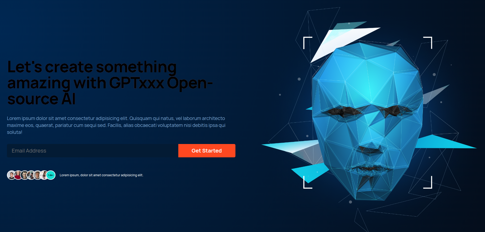

## Table of contents

- [Overview](#overview)
  - [Screenshot](#screenshot)
  - [Links](#links)
- [My process](#my-process)
  - [Built with](#built-with)
  - [What I learned](#what-i-learned)
  - [Continued development](#continued-development)
- [Author](#author)

## Overview

### Screenshot

### Links

- Solution URL: (https://github.com/OT61/GPTxxx)
- Live Site URL: (https://gptxxx.netlify.app)

## My process

### Built with

- Semantic HTML5 markup
- CSS custom properties
- Flexbox
- CSS Grid
- Mobile-first workflow
- [React](https://reactjs.org/) - JS library
- [Styled Components](App.css & index.css) - For styles

### What I learned

From this project I was able to:
- Understand the importance of using REACT to create web apps.
- Learn about JSX, and the best file and folder structure when using REACT.
- Understand DOM (Document Object Model) which is not updated directly like in HTML. REACT has what is called a Virtual DOM which is a JS object, and it is a lightweight representation of the DOM.
- Use PROPS - used props to pass dynamic data through reach components via attributes. Every component has a built in props object.
- Realize that states cannot be used without hooks. I understood that a React state is just a plain JS object used by REACT to represent a piece of information about a components current situation.

### Continued development

Areas I want to continue focusing on in future projects:
- Props
- Creating State in REACT
- Fuctional Components 
- React DOM
- Implenenting Backend technoligies like PHP, RUBY, Nodejs etc in my apps.

## Author

<!-- - Website - [Toluwani Ogundare](https://www.your-site.com) -->
<!-- - Twitter - [@yourusername](https://www.twitter.com/yourusername) -->